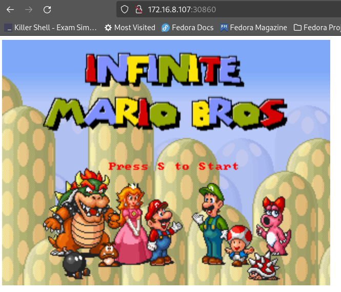

# Hello Pod Helm



This repository showcases a single-pod pattern deployment on Kubernetes. Additionally, it includes a setup for deploying Super Mario using that pattern with a service exposing a NodePort.

## Contents

- [Overview](#overview)
- [Prerequisites](#prerequisites)
- [Manual Deployment](#manual-deployment)
- [Helm Deployment](#helm-deployment)
- [Cleanup](#cleanup)
- [Directory Structure](#directory-structure)
- [Contributing](#contributing)
- [License](#license)

## Overview

This repository demonstrates two deployment methods:
1. **Manual Deployment** using `kubectl apply -f`.
2. **Helm Deployment** using `init.sh` script.

The example application, Super Mario, is deployed with a NodePort service for external access.


## Prerequisites

- Kubernetes cluster (Minikube, GKE, EKS, AKS, etc.)
- `kubectl` configured to interact with your Kubernetes cluster
- Optional: Helm installed (if using Helm deployment)

## Manual Deployment

To manually deploy the application, run the following command:

```sh
kubectl apply -f hello-pod-single-pod.yml
kubectl apply -f supermario-pod-single-pod-pattern-wtih-service.yml
```

## Helm Deployment

To deploy the application using Helm, run the `init.sh` script. This script will install Helm (if not already installed) and deploy the application using a Helm chart.

```sh
./init.sh

This script performs the following steps:

- Installs Helm (if not already installed)
- Deploys the application using Helm
```

## Cleanup

To clean up the deployed resources, run the `clean.sh` script:

```sh
./clean.sh
```

This script will remove the Helm release and delete the resources created by the manual deployment.


Let's fix the **Directory Structure** section again for clarity:

```markdown
## Directory Structure

```plaintext
hello-pod-helm/
├── charts/
│   └── supermario/
├── templates/
│   └── deployment.yaml
├── init.sh
├── clean.sh
├── README.md
```

- `charts/supermario/`: Contains the Helm chart for the Super Mario application.
- `templates/deployment.yaml`: The Kubernetes deployment manifest.
- `init.sh`: Script to initialize and deploy using Helm.
- `clean.sh`: Script to clean up the deployed resources.


## Contributing

Feel free to open issues or submit pull requests if you find any bugs or have suggestions for improvements.


